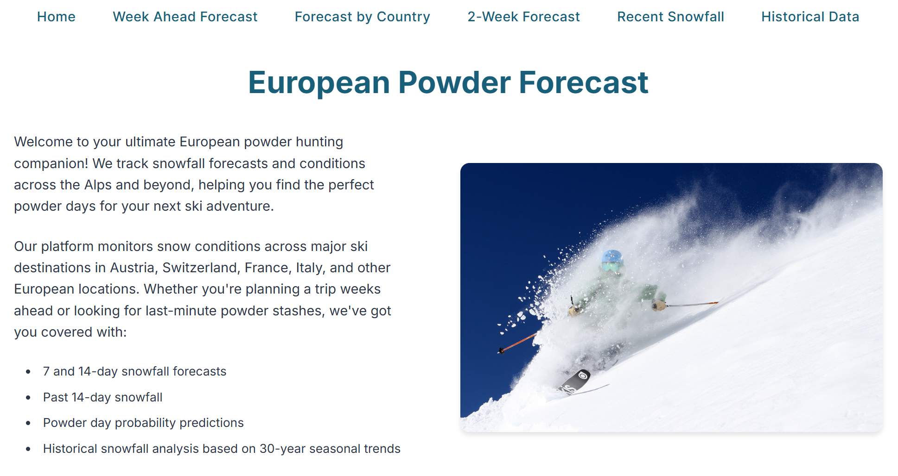
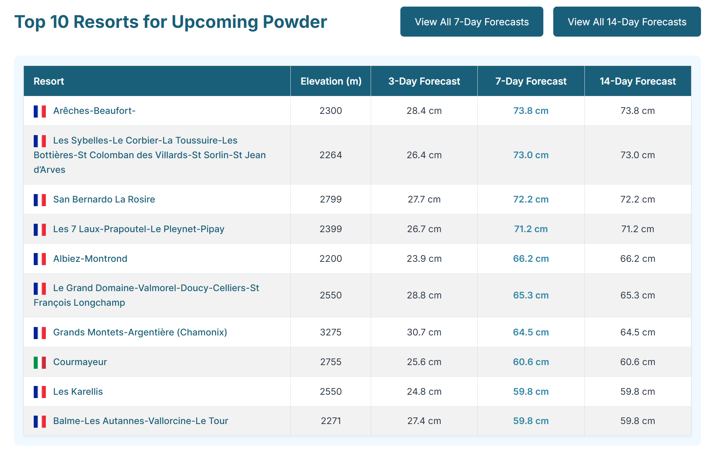
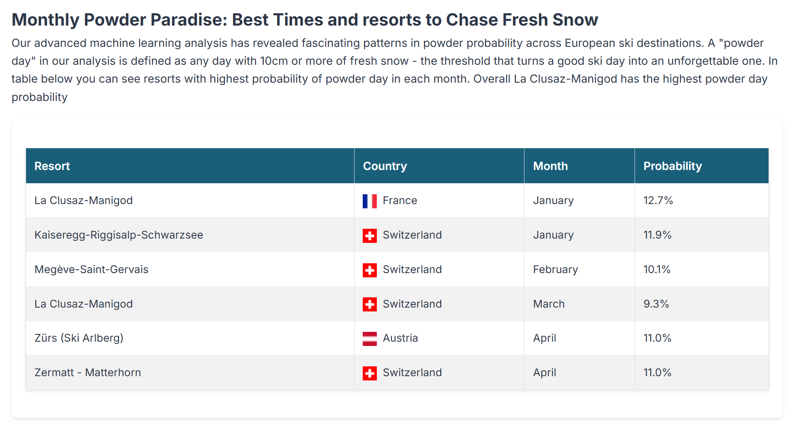

# European Powder Forecast

## About
A comprehensive web platform for tracking and predicting powder conditions across European ski resorts, with a special focus on the Alps. The site combines real-time forecasts with historical analysis to help skiers find the best powder opportunities.

Visit the live platform: [powderforecasteurope.onrender.com](https://powderforecasteurope.onrender.com/)

**Project Inspiration**: This project was inspired by [wepowder.com](https://wepowder.com/en/forecast#snow-cumulative:168). However, after noticing potential snowfall data inflation issues (possibly due to different weather models), I decided to create a more accurate alternative.

## Platform Overview

*Main dashboard showing resort overview and current conditions*

*Detailed 7-day powder forecast visualization*

*Historical snow data and powder probability analysis*

## Features

- **Snowfall Forecasts**
  - 7-day forecasts for all monitored resorts
  - 14-day extended forecasts
  - 3-day detailed predictions
  - Country-specific forecasting views

- **Historical Analysis**
  - 30-year historical snowfall data analysis
  - Powder day probability calculations (10cm+ fresh snow)
  - Monthly powder probability rankings by country
  - Recent 14-day snowfall tracking

- **Navigation Structure**
  - Home (Overview and top rankings)
  - Week Ahead Forecast
  - Forecast by Country
  - 2-Week Forecast
  - Recent Snowfall
  - Historical Data

## Key Insights

### Powder Probability Analysis
The site features a unique powder prediction system based on 30-year historical data. Key findings include:

- **Top Overall Resort**: La Clusaz-Manigod with highest powder day probability
- **Country Strengths**:
  - France: Dominates early season (December-January)
  - Switzerland: Most consistent through core winter months
  - Austria: Excellence in spring conditions
  - Italy: Strong late-season performance

### Monthly Recommendations

- **December-January**: Focus on French resorts, particularly La Clusaz area
- **February**: Swiss resorts offer most consistent powder
- **March-April**: High-altitude Austrian and Swiss resorts for late-season powder

## Methodology

The powder probability analysis is based on:
- Definition of a powder day: 10cm+ fresh snow
- 30-year historical data analysis
- Validation through random forest regression modeling
- Inspired by [Best Snow](https://bestsnow.net/pwdrpct.htm) methodology

## Technical Implementation

The website is built with:
- Node.js/Express backend
- EJS templating
- Python for data analysis
- Responsive design with mobile-friendly navigation
- Interactive data tables and visualizations

## Future Development

Areas for potential enhancement:
- Integration of machine learning for improved predictions
- Additional historical data analysis features
- Enhanced visualization tools
- Real-time condition updates
- Caching and optimization of memory

## Contributing

Contributions are welcome! Please feel free to submit a Pull Request.
